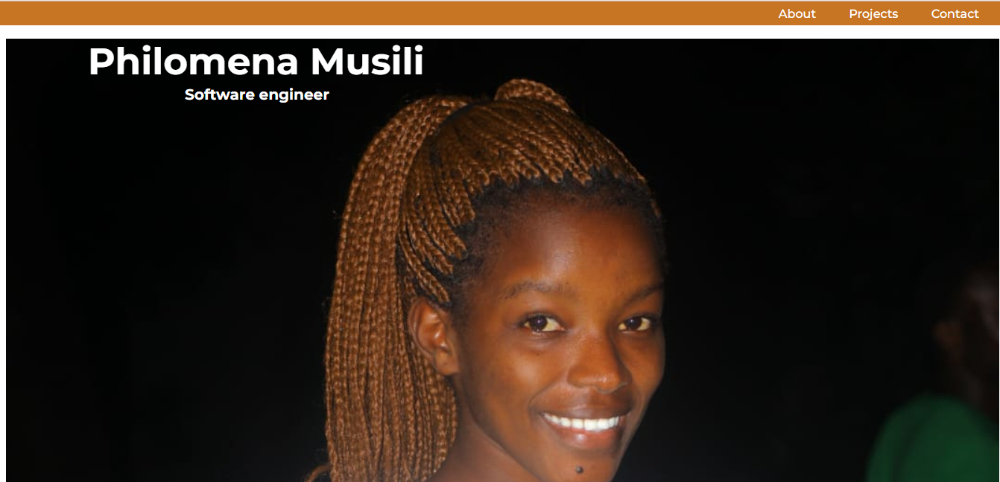

# Portfolio
This is a portfolio website showcasing the work and skills of Philomena Musili, an aspiring Frontend Software Engineer. The website provides information about the developer, displays a collection of projects, and offers contact details for potential collaboration.
## Preview

## Table of Contents
About

Projects

Contact

Getting Started

Technologies Used

License
## About
The About section of the website provides an introduction to Philomena Musili and her passion for frontend development. It highlights her educational background, skills, and dedication to learning and growing in the field.

## Projects
The Projects section showcases a selection of Philomena Musili's school projects. Each project is accompanied by a brief description and a link to the live demo. Visitors can explore these projects to see the developer's ability to create visually appealing and interactive websites.

## Contact
The Contact section provides various ways to get in touch with Philomena Musili for potential collaborations. Visitors can find links to her GitHub profile, LinkedIn profile, email address, and phone number.

## Getting Started
To view the website locally, follow these steps:

Clone the repository: git clone https://github.com/your-username/portfolio.git
Navigate to the project directory: cd portfolio
Open the index.html file in a web browser.
## Technologies Used
HTML

CSS

JavaScript

React

Angular
## License

This project is licensed under the MIT License.
